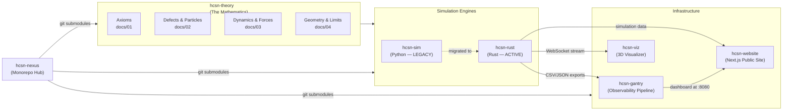
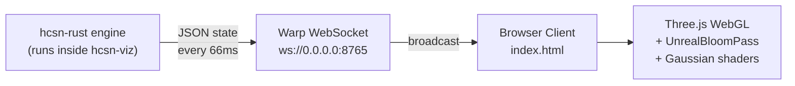
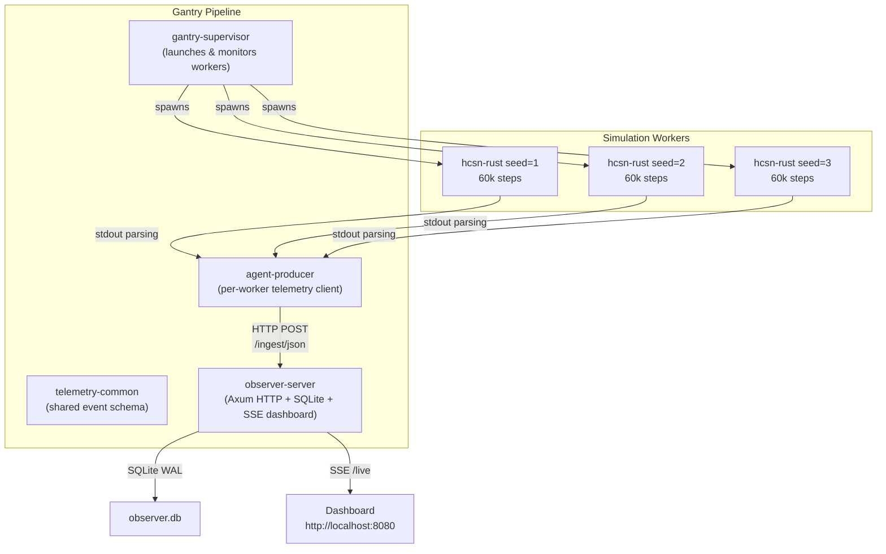
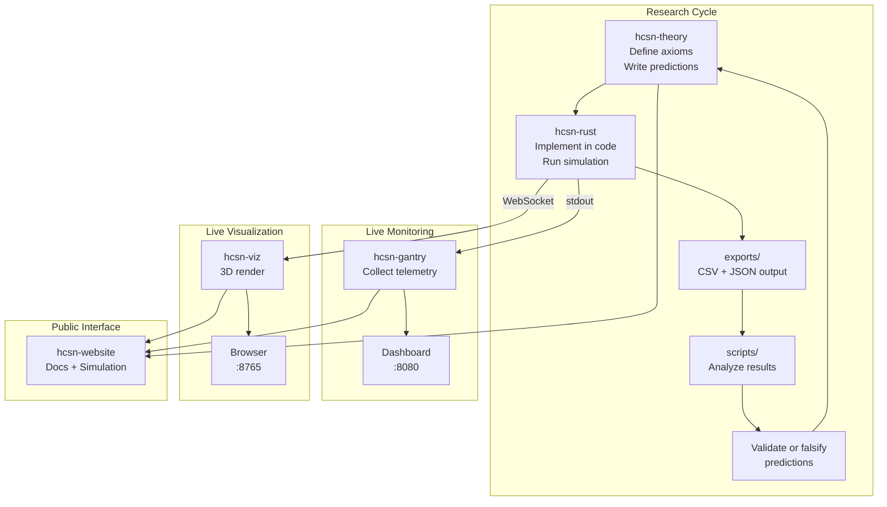

# HCSN Ecosystem Guide — All Repositories Explained
## Beyond hcsn-rust: The Full Infrastructure

**This document covers:** hcsn-sim · hcsn-viz · hcsn-gantry · hcsn-theory · hcsn-website · hcsn-nexus  
**Purpose:** Understand every repo in the HCSN project and how they connect

---

# MASTER ARCHITECTURE



---

# REPO 1: `hcsn-theory` — The Mathematics

**Language:** Markdown + LaTeX  
**Role:** The canonical source of truth for HCSN axioms and empirical results  
**Status:** ACTIVE — continuously updated as simulation results validate or falsify claims

## Directory Structure

```
hcsn-theory/
├── docs/
│   ├── 01_axioms_and_methodology.md      ← The 5 axioms
│   ├── 02_defects_worldlines_and_particles.md  ← Particle definitions
│   ├── 03_emergent_dynamics_momentum_and_interaction.md  ← Force laws
│   └── 04_geometry_dimension_uncertainty_and_limits.md   ← Open problems
├── figures/                               ← Diagrams and plots
├── MANIFESTO.md                           ← Research philosophy
├── WORKSPACE_STATUS.md                    ← Current phase status
└── README.md
```

## What Each Document Contains

### `01_axioms_and_methodology.md` — The Foundation
- **Axiom 0:** Discrete Relational Substrate (H = (V, E), no background space)
- **Axiom 1:** Causal Consistency (DAG, no time loops)
- **Axiom 2:** Local Rewrite Dynamics (only local operations)
- **Axiom 3:** Local Finiteness (finite causal cones)
- **Axiom 4:** Hierarchical Closure Tension (Ω as order parameter)
- **Axiom 5:** Defect Permissibility (localized violations allowed)
- Methodology: operational definitions, falsifiability criteria, what is NOT claimed

### `02_defects_worldlines_and_particles.md` — What Are Particles?
- Defect = discontinuous Ω change: |ΔΩ(t)| > ε
- Defect charge Q = ΔΩ (NOT conserved exactly)
- Persistent defect = bounded temporal separation + correlated support
- Worldline = equivalence class of persistent defects
- Particle criterion: persistence + momentum coherence + inertial stability + structural coupling
- Identity via overlap continuity: |C(t) ∩ C(t+1)| / |C(t) ∪ C(t+1)| ≥ α
- Mass: m ~ 1/Var(p) (inverse momentum variance)
- Interaction: threshold-gated at χ > 0.14

### `03_emergent_dynamics_momentum_and_interaction.md` — Forces and Motion
- Time = rewrite depth (not a clock)
- Momentum = statistical persistence of rewrite imbalance
- Three equivalent measures: before/after asymmetry, causal displacement variance, flux persistence
- Interaction strength: F_AB = |Φ_A − Φ_B| / τ_coexist
- Empirical coupling k = 182.1
- Mean deflection θ = 71.5° (back-scattering bias)
- Fragile conservation: Spearman ρ = −0.47 ± 0.16
- Ontological shift table: Force→Rewrite suppression, Distance→Rewrite overlap, etc.

### `04_geometry_dimension_uncertainty_and_limits.md` — Open Problems
- Geometry is emergent, not assumed
- Phase diagram: subcritical/critical/supercritical Ω regimes
- Ω is NOT a carrier — it is an order parameter (corrects earlier claims)
- ξ transport without geometry (transport before space exists)
- Effective dimension via Myrheim-Meyer: D_eff(r) = d log N(r) / d log r
- Preliminary dimension estimates: 3–5 range (non-conclusive)
- 6 explicit open problems listed
- 4 falsifiability criteria (3 passed, 1 under test)

## How Theory Connects to Code

| Theory Concept | Code Implementation |
|:---|:---|
| Axiom 0 (Hypergraph) | `hypergraph.rs` → `Hypergraph` struct |
| Axiom 1 (Causal DAG) | `add_causal_relation()` + `FixedBitSet` |
| Axiom 2 (Local rewrites) | `rules.rs` → `edge_creation_rule`, `vertex_fusion_rule` |
| Axiom 3 (Finite cones) | Bitset capacity 524,288 |
| Axiom 4 (Ω) | `observables.rs` → `compute_omega()` |
| Axiom 5 (Defects) | `defect_density()`, `label_frustration()` |
| Particle definition | `detect_candidate_knot_neighborhoods()` |
| Mass formula | `knot.mass = size × coherence²` |
| Interaction threshold | `chi > 0.015` in `perform_kinematics_and_interactions()` |
| Conservation hypothesis | `ConservationMode::Hybrid` in `rewrite_engine.rs` |

---

# REPO 2: `hcsn-sim` — The Original Python Engine (LEGACY)

**Language:** Python 3.10+  
**Role:** The first implementation of HCSN. Now superseded by hcsn-rust.  
**Status:** LEGACY — kept for reference and cross-validation only

## Why It Was Replaced

Python's Global Interpreter Lock (GIL) prevents true parallelism. For simulations requiring:
- O(N²) causal lookups per step
- Millions of dictionary operations
- Bitwise operations on large sets

...Python was 50–100× slower than Rust. A 250,000-step run that takes 12 minutes in Rust took ~2 hours in Python.

## Directory Structure

```
hcsn-sim/
├── engine/                      ← Core simulation (MIRRORS hcsn-rust/src/)
│   ├── hypergraph.py            ← Same data structures as hypergraph.rs
│   ├── rules.py                 ← Same rewrite rules as rules.rs
│   ├── rewrite_engine.py        ← Same loop as rewrite_engine.rs
│   ├── observables.py           ← Same measurements as observables.rs
│   └── physics_params.py        ← Same parameters as physics_params.rs
│
├── sim-exp/                     ← Reproducible experiments
│   ├── run_simulation.py        ← Main runner
│   ├── exp_critical_scan.py     ← Phase transition sweep
│   ├── exp_phase_diagram.py     ← Ω phase map
│   ├── exp_worldline_interactions.py  ← Two-particle test
│   └── scattering_experiment.py ← Scattering geometry
│
├── multiverse/                  ← Multi-variant universe runs
│   ├── baseline/
│   └── variant_1/ ... variant_4/
│
├── visualizer.html              ← Browser-based 2D visualizer
├── visualizer_server.py         ← WebSocket server for visualizer
├── blender_importer.py          ← Import frames into Blender 3D
├── export_cinematic.py          ← Export simulation to cinematic JSON
├── export_csv.py                ← Export to CSV format
├── cinematic_frames.json        ← Pre-exported cinematic data (27 MB)
└── hcsn_sample.csv              ← Sample output (3.5 MB)
```

## Key Differences from Rust Version

| Feature | Python (hcsn-sim) | Rust (hcsn-rust) |
|:---|:---|:---|
| Causal lookup | O(N) dict traversal | O(1) FixedBitSet read |
| Causal intersection | Python set operations | Bitwise AND (SIMD) |
| Parallelism | GIL blocks true parallel | Rayon data parallelism |
| Memory | Python objects (~100 bytes each) | Raw u64 (8 bytes each) |
| Speed | ~30 min for 50k steps | ~2 min for 50k steps |
| Visualization | Built-in WebSocket server | Separate hcsn-viz repo |
| Blender export | Built-in | Not included |

## When You Would Still Use hcsn-sim

1. **Cross-validation:** Run the same experiment in both Python and Rust to verify results match
2. **Blender rendering:** The cinematic export pipeline is only in hcsn-sim
3. **Quick prototyping:** Python is faster to modify than Rust for testing new ideas
4. **Teaching:** Python code is more readable for non-programmers

---

# REPO 3: `hcsn-viz` — The Obsidian Observer (3D Visualizer)

**Language:** Rust (backend) + HTML/JavaScript/Three.js (frontend)  
**Role:** Real-time 3D visualization of the running simulation  
**Status:** ACTIVE — the primary visual interface for HCSN

## Architecture



## How It Works

### Backend (`src/main.rs` — 202 lines)

The visualizer runs its OWN copy of the HCSN engine internally:

```
1. Create Hypergraph seed (2 vertices, 1 edge)
2. Create RewriteEngine (p_create from HCSN_P_CREATE env var)
3. Start infinite loop:
   a. engine.step()  — advance simulation one tick
   b. Every 66ms (15 fps):
      - Read active_knots from engine
      - Build JSON state: vertices, edges, knots, stats
      - Broadcast via WebSocket to all connected browsers
```

Key constants:
- `MAX_VERTICES = 350` — only send 350 vertices per frame (performance)
- `MAX_EDGES = 700` — only send 700 edges per frame
- `STREAM_HZ = 15` — 15 frames per second broadcast rate

Priority system: vertices in ACTIVE KNOTS are always included. Remaining slots filled with inactive vertices (most recent first).

### Frontend (`index.html` — 47,752 bytes)

A full Three.js WebGL application with:
- **Macro-Physics Spatial Layout:** Vertices get 3D positions via force-directed layout
  - Coulomb repulsion (nodes push apart)
  - Spring attraction (edges pull together)
  - Knot centroids computed as synthetic centers
- **Gaussian Node Shaders:** Each vertex glows based on its stability value
  - High stability → bright white/blue glow
  - Low stability → dim, faded
- **UnrealBloomPass:** HDR glow post-processing for cinematic look
- **Interactive Camera:** Orbit controls, zoom, focus-lock on specific knots
- **Live Stats Panel:** Shows time, Ω, vertex count, knot count, total mass

### The Unidirectional Rule (CRITICAL)

> The visualizer receives state from the engine, but **NO conclusions or forces from the visualizer are ever imported back into the core engine physics.**

The 3D positions, colors, glow effects, and camera movements are purely visual. They have no physical meaning. The engine operates on topology only — it has no concept of 3D space.

## JSON State Format (sent each frame)

```json
{
  "t": 15000,
  "phase": 1,
  "phase_label": "OBSERVING SPONTANEOUS KNOTS",
  "omega": 1.234567,
  "xi_max": 5.432,
  "vertices": [
    {"id": 500, "depth": 42, "label": 0, "xi": 0.85, "cluster": 3}
  ],
  "edges": [[500, 501, 502]],
  "knots": [
    {"id": 3, "coherence": 2.5, "mass": 15.2, "age": 500}
  ],
  "stats": {
    "total_vertices": 1200,
    "total_edges": 3400,
    "xi_count": 45,
    "xi_clusters": 3,
    "total_mass": 47.3
  }
}
```

## How to Run

```bash
cd hcsn-viz
cargo run --release
# Open http://localhost:8765 in browser
```

---

# REPO 4: `hcsn-gantry` — The Observability Pipeline

**Language:** Rust (Tokio async)  
**Role:** Production-grade monitoring, logging, and dashboarding for simulation runs  
**Status:** ACTIVE — used for managing multi-seed parametric experiments

## Why Gantry Exists

When running 9+ independent simulation seeds for statistical validation (as in Phase 12), you need:
- Live progress monitoring for each worker
- CPU/RAM health tracking
- Crash detection and recovery
- Centralized log aggregation
- A dashboard to see everything at once

Gantry provides all of this as a single `cargo run` command.

## Architecture



## The Four Crates

### 1. `telemetry-common` — Shared Event Schema

Defines the universal data format that all components speak:

```rust
pub enum TelemetryKind { Log, Metric, Trace, Panic }

pub struct TelemetryEnvelope {
    pub event_id: Uuid,       // Unique ID for this event
    pub worker_id: String,    // Which simulation worker
    pub span_id: String,      // Current operation span
    pub trace_id: String,     // Full trace across spans
    pub seq: u64,             // Sequence number
    pub ts: DateTime<Utc>,    // Timestamp
    pub kind: TelemetryKind,  // What type of event
    pub payload: TelemetryPayload,  // The actual data
}

pub struct MetricEvent {
    pub cpu_pct: f32,          // CPU usage %
    pub ram_mb: f32,           // RAM usage MB
    pub progress_pct: f32,     // Simulation progress %
    pub omega: Option<f32>,    // Current Ω value
    pub knots: Option<u32>,    // Number of active knots
    pub max_coh: Option<f32>,  // Maximum coherence
    pub coordination: Option<f32>,  // Average coordination
    pub chain_length: Option<u32>,  // Causal depth
}
```

### 2. `agent-producer` — Worker-Side Telemetry

Each simulation worker gets an agent-producer that:
- Monitors CPU and RAM usage via `sysinfo` crate
- Parses stdout progress table rows from `run_simulation`
- Extracts Ω, knots, coherence, chain_length from printed output
- Batches events (128 events or 200ms, whichever comes first)
- Sends HTTP POST to observer-server

### 3. `observer-server` — Central Collector

An Axum (async HTTP framework) server that:
- Listens on `http://0.0.0.0:8080`
- Accepts JSON batches at `POST /ingest/json`
- Accepts OTLP protobuf at `POST /ingest/protobuf`
- Stores everything in SQLite (WAL mode for concurrent writes)
- Serves SSE (Server-Sent Events) for live dashboard updates
- Serves HTML dashboard via `maud` templating

SQLite pragmas for performance:
```sql
PRAGMA journal_mode=WAL;       -- Write-Ahead Logging for concurrent reads
PRAGMA synchronous=NORMAL;     -- Balanced durability/speed
PRAGMA temp_store=MEMORY;      -- Temp tables in RAM
PRAGMA cache_size=-20000;      -- 20MB page cache
```

### 4. `gantry-supervisor` — The Orchestrator

Three operating modes:

**Synthetic mode** (default):
```bash
cargo run -p gantry-supervisor
# Launches fake workers that generate synthetic telemetry
# Good for testing the dashboard
```

**HCSN mode** (production):
```bash
WORKER_BACKEND=hcsn \
WORKER_COUNT=5 \
HCSN_BIN=run_simulation \
HCSN_STEPS=60000 \
HCSN_P_CREATE=0.64 \
SEED_START=1 \
cargo run -p gantry-supervisor
```
This spawns 5 real `hcsn-rust` workers with seeds 1–5 and monitors them.

**External mode** (watch existing runs):
```bash
WORKER_BACKEND=external \
HCSN_ROOT=/home/saif/hcsn-nexus/hcsn-rust \
cargo run -p gantry-supervisor
```
Does NOT launch workers. Watches exported JSON files and ingests them.

## Dashboard Features

Opening `http://localhost:8080`:
- **Live Feed:** Real-time log stream per worker (via SSE)
- **Health Charts:** CPU/RAM/Progress graphs per worker
- **Physics Metrics:** Ω, knots, coherence plotted over time
- **Black Box Recorder:** Last 50 logs + latest panic for each worker
- **Worker List:** All active/completed/crashed workers at a glance

---

# REPO 5: `hcsn-website` — The Public Interface

**Language:** Next.js (TypeScript) + TailwindCSS  
**Role:** Public-facing website for HCSN research  
**Status:** ACTIVE — deployed via GitHub Pages

## Directory Structure

```
hcsn-website/
├── app/                    ← Next.js App Router pages
│   ├── page.tsx            ← Homepage (hero + research overview)
│   ├── about/page.tsx      ← About the project
│   ├── docs/page.tsx       ← Documentation browser
│   ├── simulation/page.tsx ← Live simulation connection
│   └── logs/page.tsx       ← Gantry log viewer
├── components/             ← Reusable UI components
├── config/                 ← Site configuration
├── lib/                    ← Utility functions
├── public/                 ← Static assets
├── styles/                 ← Global CSS
├── next.config.js          ← Build configuration
├── tailwind.config.ts      ← TailwindCSS theme
└── package.json            ← Dependencies
```

## Key Pages

### Homepage (`/`)
- Hero section with HCSN branding
- Research overview cards
- Links to theory docs, simulation, and repos

### Simulation Page (`/simulation`)
- Connects to hcsn-viz WebSocket at ws://localhost:8765
- Shows live 3D visualization in browser
- Quick-start guide for local setup
- Retry/Change Node connection controls

### Docs Page (`/docs`)
- Renders theory docs from hcsn-theory
- Markdown → HTML conversion with LaTeX support
- Navigation sidebar for all 4 theory documents

### Logs Page (`/logs`)
- Connects to hcsn-gantry dashboard
- Full-screen immersive log viewing environment
- Markdown/JSON rendering for structured logs

## How to Run

```bash
cd hcsn-website
npm install
npm run dev      # Development server at http://localhost:3000
npm run build    # Production build for GitHub Pages
```

---

# REPO 6: `hcsn-nexus` — The Monorepo Hub

**Role:** Git submodule aggregator that ties everything together  
**Status:** ACTIVE — the primary workspace

## What It Contains

```
hcsn-nexus/
├── hcsn-rust/       ← git submodule → active Rust engine
├── hcsn-sim/        ← git submodule → legacy Python engine
├── hcsn-theory/     ← git submodule → theory documents
├── hcsn-gantry/     ← git submodule → observability pipeline
├── hcsn-viz/        ← git submodule → 3D visualizer
├── hcsn-website/    ← git submodule → public website
├── graphify-out/    ← knowledge graph output
├── emergence.md     ← Detailed emergence development record
├── MANIFESTO.md     ← Research philosophy
├── README.md        ← Project overview
├── knowledge.md     ← Condensed knowledge summary
├── full-knowledge.md ← Extended knowledge base
├── metadata.json    ← Project metadata
└── HCSN_COMPLETE_REFERENCE_PART1/2/3.md  ← Your interview docs
```

## Git Submodule Management

```bash
# Clone with all submodules
git clone --recursive https://github.com/hcsn-theory/hcsn-nexus

# Update all submodules to latest
git submodule update --remote --merge

# Check submodule status
git submodule status
```

---

# HOW EVERYTHING CONNECTS — The Data Pipeline



## Typical Research Workflow

```
1. HYPOTHESIS: Write prediction in hcsn-theory/docs/
2. IMPLEMENT:  Modify hcsn-rust/src/rewrite_engine.rs
3. COMPILE:    cargo build --release
4. RUN:        HCSN_STEPS=60000 HCSN_P_CREATE=0.64 cargo run --release --bin run_simulation -- --steps 60000 --seed 1
5. MONITOR:    Open hcsn-gantry dashboard at :8080
6. VISUALIZE:  Open hcsn-viz at :8765
7. ANALYZE:    Run scripts on exports/ directory
8. VALIDATE:   Compare results to prediction
9. DOCUMENT:   Update hcsn-theory/docs/ with results
10. PUBLISH:   Deploy hcsn-website via GitHub Pages
```

---

# SUMMARY TABLE

| Repo | Language | Lines | Role | Status |
|:---|:---|:---|:---|:---|
| **hcsn-theory** | Markdown/LaTeX | ~1000 | Mathematical foundation | Active |
| **hcsn-rust** | Rust | ~3000 | Production simulation engine | Active (Phase 12) |
| **hcsn-sim** | Python | ~2000 | Legacy engine | Legacy (reference only) |
| **hcsn-viz** | Rust + JS | ~250 + 48K HTML | 3D real-time visualizer | Active |
| **hcsn-gantry** | Rust (Tokio) | ~2000 | Observability pipeline | Active |
| **hcsn-website** | Next.js/TS | ~5000 | Public website | Active |
| **hcsn-nexus** | Git submodules | — | Monorepo aggregator | Active |

---

*End of HCSN Ecosystem Guide*
*Read alongside: HCSN_COMPLETE_REFERENCE_PART1/2/3.md + HCSN_SIMULATION_WORKFLOW.md*
