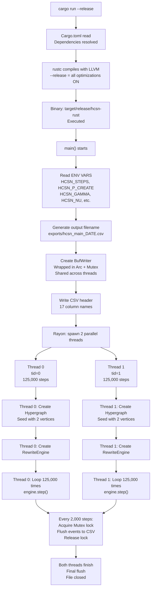
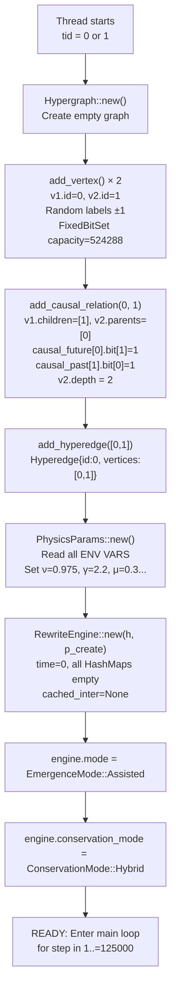
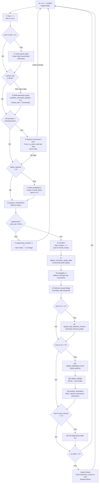
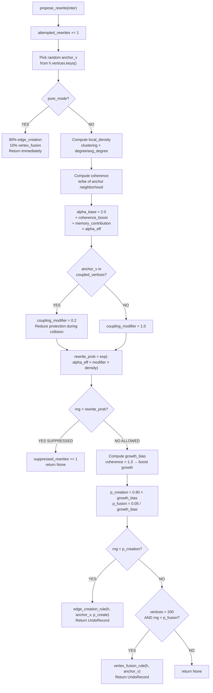
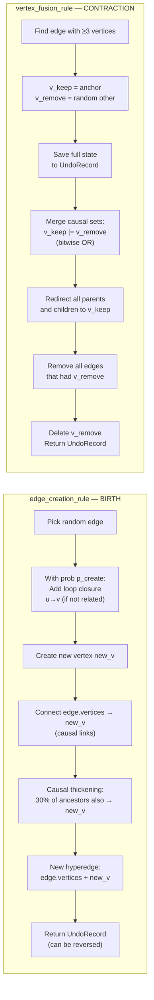
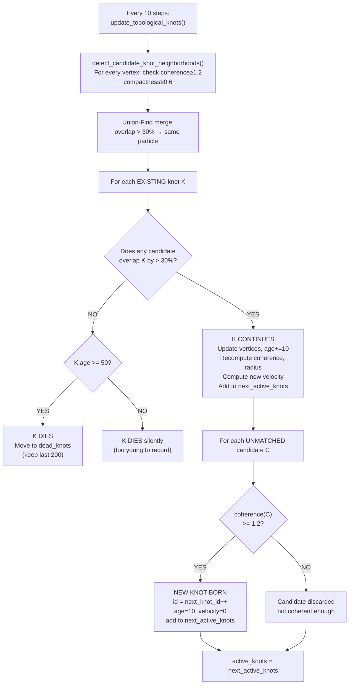
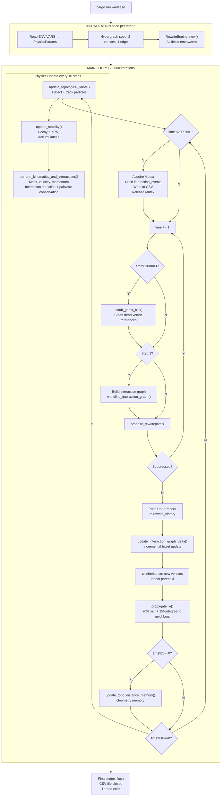

# HCSN Simulation Workflow — Full Technical Reference
## How the Universe Runs: Execution Path from Terminal to Data File

**This document covers:** Exact function-call order · Line-by-line logic · Mermaid flowcharts · Time definition · Data lifecycle  
**Source files:** `main.rs`, `rewrite_engine.rs`, `hypergraph.rs`, `rules.rs`, `observables.rs`, `persistence.rs`, `physics_params.rs`

---

# SECTION 1 — TOP-LEVEL EXECUTION: From Terminal to Threads

## 1.1 What Happens When You Type `cargo run --release`

The Rust toolchain does the following **before your code runs**:

1. `cargo` reads `Cargo.toml` — this lists all dependencies and which binary to build
2. `rustc` compiles every `.rs` file into native machine code (LLVM backend)
3. `--release` flag tells LLVM: enable all optimizations (unroll loops, inline functions, use SIMD instructions)
4. The compiled binary is placed in `target/release/hcsn-rust`
5. The binary is executed

When you use `cargo run --release --bin run_simulation`, it runs the `run_simulation.rs` binary instead of `main.rs`. But the core engine is the same.

---

## 1.2 `main.rs` — The Entry Point (Line by Line)

```
main.rs execution order:
────────────────────────
Line 1–10:   Import declarations (use statements)
Line 11–20:  Read environment variables
Line 21–30:  Generate output filename
Line 31–40:  Create shared CSV writer
Line 41–78:  Spawn parallel threads and run simulation
```

**Step-by-step:**

### Step 1: Read Physics Configuration
```rust
let total_steps: usize = std::env::var("HCSN_STEPS")
    .unwrap_or_else(|_| "250000".to_string())
    .parse().unwrap_or(250000);

let p_create: f64 = std::env::var("HCSN_P_CREATE")
    .unwrap_or_else(|_| "0.58".to_string())
    .parse().unwrap_or(0.58);
```

`std::env::var("HCSN_STEPS")` reads the environment variable `HCSN_STEPS`.  
- If it exists: use it  
- If it doesn't exist (`unwrap_or_else`): use default `"250000"`  
- `.parse().unwrap_or(250000)`: convert string to number, or use 250000 if conversion fails

This is why you can run `HCSN_STEPS=1000000 cargo run --release` to change steps without recompiling.

### Step 2: Hard-Lock to 2 Threads
```rust
let num_threads: usize = 2;
let steps_per_thread = total_steps / num_threads;  // = 125,000 per thread
```

This is a deliberate scientific decision. Running 2 independent universes simultaneously gives double the data. More importantly, it tests whether the same physics emerges across different causal histories (different random seeds).

### Step 3: Create Shared Output File
```rust
let out_file = Persistence::generate_filename("main");
// → "exports/hcsn_main_2026-05-04_21-30-00.csv"

let f = std::fs::File::create(&out_file).unwrap();
let mut writer = BufWriter::new(f);
Persistence::write_header(&mut writer).unwrap();

let shared_writer = Arc::new(Mutex::new(writer));
```

**`Arc`** = Atomic Reference Counter. A smart pointer that allows multiple owners. When the last owner drops it, the memory is freed. Thread-safe.

**`Mutex`** = Mutual Exclusion lock. Only one thread can hold it at a time. Prevents two threads writing to the file simultaneously (which would corrupt the CSV).

**`BufWriter`** = Buffer writer. Instead of physically writing to disk every time you call `write!()`, it accumulates data in a memory buffer and flushes in large chunks. Drastically reduces disk I/O overhead.

### Step 4: Spawn Parallel Threads via Rayon
```rust
(0..num_threads).into_par_iter().for_each(|tid| {
    // Everything inside here runs simultaneously on each thread
    // tid = 0 on thread 0, tid = 1 on thread 1
});
```

`into_par_iter()` is from the `Rayon` crate. It distributes the work across CPU cores automatically. Rayon manages its own thread pool internally.

---

## 1.3 Top-Level Flow Chart



---

# SECTION 2 — INITIALIZATION: Creating the Universe from Nothing

## 2.1 Hypergraph Initialization — The Minimal Seed

Inside each thread, before the loop starts:

```rust
// Step A: Create empty Hypergraph
let mut h = Hypergraph::new();
```

`Hypergraph::new()` creates:
- `vertices: HashMap::new()` — empty map, will hold all Vertex structs
- `hyperedges: HashMap::new()` — empty map, will hold all Hyperedge structs
- `causal_future: HashMap::new()` — empty map, will hold FixedBitSet for each vertex's future
- `causal_past: HashMap::new()` — empty map, will hold FixedBitSet for each vertex's past

```rust
// Step B: Create the first two vertices
let v1 = h.add_vertex();
let v2 = h.add_vertex();
```

`add_vertex()` does the following internally:
```
1. VERTEX_ID_COUNTER.fetch_add(1, Ordering::SeqCst)
   → Atomically increments global counter, returns old value (0 for v1, 1 for v2)
   
2. Create Vertex {
       id: 0,          // (or 1)
       depth: 1,       // Default causal depth
       label: +1/-1,   // Random coin flip
       parents: [],
       children: [],
   }

3. Insert into h.vertices: {0: vertex_0, 1: vertex_1}

4. Create FixedBitSet with capacity 524_288 bits (= 64 KB)
   Initialize all bits to 0
   
5. h.causal_future.insert(0, empty_bitset)
6. h.causal_past.insert(0, empty_bitset)
```

Why capacity 524,288? That is 2^19. It means the bitset can track causal relationships with up to 524,288 vertices before needing to grow. This avoids re-allocation for typical simulations.

```rust
// Step C: Connect them causally (create the first arrow of time)
h.add_causal_relation(v1.id, v2.id);
```

This calls `add_causal_relation(0, 1)` which does:
```
1. Check: is_causally_related(0, 1)? → No (bitsets are empty)

2. Add direct adjacency:
   v1.children.push(1)   → vertex 0's children = [1]
   v2.parents.push(0)    → vertex 1's parents = [0]

3. Get J-(0) = causal_past[0] = {} (empty — nothing precedes 0)
4. Get J+(1) = causal_future[1] = {} (empty — 1 has no known future)

5. For every p in J-(0): (none — loop doesn't execute)
   p's causal_future |= J+(1)

6. For every f in J+(1): (none — loop doesn't execute)
   f's causal_past |= J-(0)

7. Set direct bits:
   causal_future[0].insert(1)  → "vertex 0 can reach vertex 1"
   causal_past[1].insert(0)    → "vertex 1 is preceded by vertex 0"

8. Update depth:
   v2.depth = max(v2.depth, v1.depth + 1) = max(1, 2) = 2
```

```rust
// Step D: Create the first hyperedge
h.add_hyperedge(vec![v1.id, v2.id]);
```

This creates `Hyperedge { id: 0, vertices: [0, 1] }` and inserts it into `h.hyperedges`.

The universe now has: 2 vertices, 1 causal link (0→1), 1 hyperedge {0,1}.

## 2.2 RewriteEngine Initialization

```rust
let mut engine = RewriteEngine::new(h, p_create, None);
```

`RewriteEngine::new()` initializes all engine state:

```
Fields initialized:
─────────────────────────────────────────────────────
h                     = the seeded Hypergraph above
p_create              = 0.58 (from env var)
time                  = 0
mode                  = EmergenceMode::Assisted
conservation_mode     = ConservationMode::Hybrid
params                = PhysicsParams::new()  ← reads ALL env vars
xi                    = HashMap::new()  ← empty, no transport activity yet
prev_xi               = HashMap::new()
xi_threshold          = 1e-6
xi_decay              = 0.70
xi_coupling           = 0.6
stability             = HashMap::new()  ← empty, no memory yet
active_knots          = HashMap::new()  ← no particles yet
dead_knots            = Vec::new()
interaction_events    = Vec::new()
momentum_reservoir    = HashMap::new()
rewrite_history       = Vec::new()  ← no history yet
cached_inter          = None  ← will be built on step 1
topo_distance_memory  = HashMap::new()
xi_distance_memory    = HashMap::new()
distance_memory_decay = 0.9
geometry_stride       = 5
suppressed_rewrites   = 0
total_rewrites        = 0
thread_id             = Some(tid)
```

**`PhysicsParams::new()`** reads these env vars (with defaults):
```
HCSN_GAMMA_DEFECT    → gamma_defect     = 0.15
HCSN_INERTIA_SCALE   → inertia_scale    = 1.0
HCSN_INTERACTION_BOOST → interaction_boost = 1.02
HCSN_NU              → stability_decay  = 0.975
HCSN_GAMMA           → nonlinear_coupling = 2.2
HCSN_MU              → memory_coupling  = 0.3
HCSN_DEFECT_INJECTION → defect_injection = 0.0
HCSN_PATCHES         → enable_conservation_patches = true
HCSN_EXPORT_MECHANISMS → export_mechanisms = false
```

## 2.3 Initialization Flow Chart



---

# SECTION 3 — THE MAIN LOOP: One Step at a Time

## 3.1 What "One Step" Means

```rust
for s in 1..=steps_per_thread {
    engine.step();
    
    if s % 2000 == 0 || s == steps_per_thread {
        // Flush to disk
    }
}
```

Every iteration calls `engine.step()` exactly once. This is the **atomic unit of HCSN time**. After `step()` returns, `engine.time` has increased by 1, and the universe has undergone exactly one transformation attempt.

## 3.2 `step()` — Complete Execution Order

Here is the complete ordered list of every operation inside one call to `step()`:

```
STEP EXECUTION ORDER (complete)
═══════════════════════════════════════════════════════════════

① self.time += 1
   → Time counter advances. This is HCSN's definition of time.

② PERIODIC CLEANUP (every 100 steps):
   if self.time % 100 == 0 {
       self.h.scrub_ghost_bits()
   }

③ BOOTSTRAP (step 1 only):
   if self.cached_inter.is_none() {
       let inter = worldline_interaction_graph(&self.h, 0.1)
       self.cached_inter = Some(inter)
       // also initializes interaction_counts from graph
   }

④ TIME SYMMETRY UNDO (if ConservationMode::TimeSymmetry):
   Measure momentum error across active knots
   If error > 0.5: p_undo = 0.20 else p_undo = 0.05
   If rng < p_undo: pop rewrite_history, undo last step, return

⑤ VACUUM NUCLEATION (if defect_injection > 0):
   With probability params.defect_injection:
       Create 4 new vertices
       Connect all pairs causally (6 links total, a complete directed graph)
       Add 4 hyperedges
       Inject xi = 1.0 on all 4 vertices

⑥ PROPOSE REWRITE:
   let undo_opt = self.propose_rewrite(&inter)

⑦ CHECK IF SUPPRESSED:
   if undo_opt.is_none() {
       self.suppressed_rewrites += 1
       return false  // Nothing changed this step
   }

⑧ ACCEPT REWRITE (currently always accepted):
   self.total_rewrites += 1
   let undo = undo_opt.unwrap()
   self.rewrite_history.push(undo.clone())
   if rewrite_history.len() > 200 { rewrite_history.remove(0) }

⑨ UPDATE INTERACTION GRAPH (delta, not full rebuild):
   self.update_interaction_graph_delta(&undo, true)

⑩ PROPAGATE ξ-FIELD:
   self.propagate_xi(&inter, &xi_clusters)

⑪ DEFERRED CAUSAL BRIDGE (if pending):
   if let Some((u, v)) = self.deferred_causal_bridge.take() {
       self.h.add_causal_relation(u, v)
   }

⑫ UPDATE GEOMETRY MEMORY (every 5 steps):
   if self.time % self.geometry_stride == 0 {
       self.update_topo_distance_memory(&inter)
   }

⑬ UPDATE KNOTS, STABILITY, KINEMATICS (every 10 steps):
   if self.time % 10 == 0 {
       self.update_topological_knots(&inter)
       self.update_stability(&inter)
       self.perform_kinematics_and_interactions(&inter)
   }

⑭ PRINT DIAGNOSTICS (every print_interval steps, default 1000):
   Print table row: time | V | <k> | Δ<k> | L | ΔL | acc% | omega | knots...

═══════════════════════════════════════════════════════════════
```

## 3.3 Main Loop Flowchart



---

*[Document continues in the same file — scroll down for Sections 4 and 5]*

---

# SECTION 4 — `propose_rewrite()`: The Core Physics Decision

This is the most important function. It decides whether a rewrite happens and what kind.
Source: `rewrite_engine.rs` lines 1109–1242.

## 4.1 Step-by-Step Algorithm

```
propose_rewrite(inter) — called once per step()
════════════════════════════════════════════════

① attempted_rewrites += 1

② Pick a random anchor vertex:
   vertices = h.vertices.keys()  (all vertex IDs)
   anchor_v = random choice from vertices

③ PURE MODE bypass (if pure_mode = true):
   Skip all suppression — just randomly apply edge_creation_rule
   or vertex_fusion_rule with 90/10 split. Used for control experiments.

④ Compute local_density around anchor:
   clustering   = local_clustering(inter, anchor_v)
                = fraction of anchor's neighbors connected to each other
   degree       = number of edges in inter touching anchor_v
   avg_degree   = total edges / total vertices  (mean degree)
   local_density = clustering × (degree / avg_degree)

   Example: clustering=0.5, degree=4, avg_degree=2 → local_density=1.0
   High density = coherent region → higher suppression

⑤ Compute coherence of anchor's 1-hop neighborhood:
   neighborhood = {anchor_v} ∪ {all neighbors of anchor_v in inter}
   (ie, be) = compute_coherence_raw(neighborhood, inter)
   coherence = ie / be  (internal edges / boundary edges)
   Special: if be=0 but ie>0 → coherence=10.0 (perfect clique)

⑥ Compute alpha_eff — suppression strength:

   alpha_base = 2.0  (always suppressing somewhat)

   coherence_boost:
     if neighborhood_size >= 4 AND coherence > 1.0:
       coherence_boost = 0.5 × (coherence − 1.0)
     else: coherence_boost = 0.0

   memory_contribution (Hypothesis 8 — nonlinear stability):
     vertex_stability = stability[anchor_v]  (0 if not tracked)
     normalized = vertex_stability / 30.0  (cap at 1.0)
     memory_contribution = 0.3 × 30.0 × normalized^2.2
                         = mu × cap × (s/cap)^gamma

   alpha_eff = alpha_base + coherence_boost + memory_contribution

⑦ coupling_modifier:
   if anchor_v is in coupled_vertices (deep overlap, chi>0.4):
     coupling_modifier = 0.2   ← REDUCE protection during collision!
   else:
     coupling_modifier = 1.0

⑧ Compute rewrite_prob:
   rewrite_prob = exp(−alpha_eff × coupling_modifier × local_density)

   Examples:
   • alpha_eff=2.0, density=0.0 → prob=1.0 (no suppression)
   • alpha_eff=2.0, density=1.0 → prob=0.135 (13.5% chance)
   • alpha_eff=5.0, density=1.0 → prob=0.007 (0.7% chance, strong knot)
   • alpha_eff=2.0, density=1.0, modifier=0.2 → prob=0.67 (during collision)

⑨ SUPPRESSION CHECK:
   if rng.gen() > rewrite_prob:
     suppressed_rewrites += 1
     return None  ← step is a no-op

⑩ Growth bias (emergence equation):
   theta = 1.3  (nucleation threshold)
   growth = if coherence > theta { 1.5 } else { 0.0 }
   boundary_ratio = 1.0 / coherence  (high coherence → low boundary ratio)
   boundary_term = 1.0 / (1.0 + 20.0 × boundary_ratio)  (sigmoid)
   growth_bias = 1.0 + growth × boundary_term

⑪ Final probabilities:
   p_creation = min(0.90 × growth_bias, 0.99)
   p_fusion   = min(0.05 / growth_bias, 0.99)

   Coherent region (coherence > 1.3):
     growth_bias ≈ 1.5 → p_creation ≈ 0.99, p_fusion ≈ 0.03
   Disordered region (coherence < 1.0):
     growth_bias = 1.0 → p_creation = 0.90, p_fusion = 0.05

⑫ Execute the rule:
   if rng < p_creation:
     → edge_creation_rule(h, anchor_v, p_create)
   else if vertices > 200 AND rng < p_fusion:
     → vertex_fusion_rule(h, anchor_v)
   else:
     → None (no valid action)
```

## 4.2 `propose_rewrite()` Flowchart



---

# SECTION 5 — The Two Rewrite Rules

These are in `rules.rs`. They are the ONLY operations that change the hypergraph.

## 5.1 `edge_creation_rule()` — Birth (Growing the Universe)

```
Inputs: h (the hypergraph), anchor_v (a vertex ID), p_rule (loop closure prob)
Output: Option<UndoRecord>

Algorithm:
──────────────────────────────────────────────────────────────

① Safety check:
   if h.hyperedges is empty → return None
   Pick a random edge from h.hyperedges

② Loop closure attempt (probability p_rule = p_create ≈ 0.58):
   if rng < p_rule AND h.vertices.len() >= 3:
     Pick 2 random existing vertices u, v
     if NOT already causally related:
       h.add_causal_relation(u, v)
       h.add_hyperedge({u, v})
       Record in undo: added_causal += [(u,v)], added_edges += [new_edge.id]

③ Create new vertex:
   new_v = h.add_vertex()
   Record in undo: added_vertices += [new_v.id]

④ Connect new vertex to all vertices in selected edge:
   for each vertex x in selected_edge.vertices:
     h.add_causal_relation(x, new_v)  // x → new_v
     Record: added_causal += [(x, new_v.id)]

⑤ Causal thickening (with probability 0.3 per ancestor):
   for each x in selected_edge.vertices:
     for each ancestor a of x (from h.causal_past[x]):
       if rng < 0.3:
         h.add_causal_relation(a, new_v)
         Record: added_causal += [(a, new_v.id)]

   This makes the new vertex "inherit" part of the causal history.
   Creates temporal thickness, not just a thin chain.

⑥ Create new hyperedge:
   new_edge_vertices = selected_edge.vertices + [new_v.id]
   new_edge = h.add_hyperedge(new_edge_vertices)
   Record: added_edges += [new_edge.id]

⑦ Return UndoRecord with everything that changed
```

**Physical meaning:** A new event is born. It is causally downstream of the existing structure. It joins the causal community. With probability p_create, two existing events that were not connected get linked (loop closure) — this creates the closed motifs that topological knots require.

## 5.2 `vertex_fusion_rule()` — Contraction (Merging Events)

```
Inputs: h (the hypergraph), anchor_v (a vertex ID)
Output: Option<UndoRecord>

Algorithm:
──────────────────────────────────────────────────────────────

① Safety checks:
   if h.vertices.len() < 3 → return None  (too small to fuse)
   Find edges with >= 3 vertices (need room to merge)
   if none found → return None

② Pick target edge and two vertices from it:
   v_keep = anchor_v  (the survivor)
   v_remove = random other vertex from selected edge

③ Critical safety: check v_remove is not the sole vertex in some edge
   if removing it would leave an empty edge → return None

④ Save full state to UndoRecord:
   removed_vertex = h.vertices.remove(v_remove)
   removed_edges = all edges containing v_remove
   old_causal_future/past = copies of bitsets for affected vertices

⑤ Merge causal identity:
   h.merge_causal_identity(v_keep, v_remove)
   → causal_future[v_keep] |= causal_future[v_remove]  (bitwise OR)
   → causal_past[v_keep]   |= causal_past[v_remove]

⑥ Redirect all adjacency:
   for each parent p of v_remove:
     p.children: replace v_remove with v_keep
   for each child c of v_remove:
     c.parents: replace v_remove with v_keep

⑦ Remove all edges that contained v_remove from h.hyperedges

⑧ Delete v_remove from h.vertices

⑨ Return UndoRecord
```

**Physical meaning:** Two distinct events become one. The new combined vertex inherits the full causal history of both. This is what creates the topological complexity needed for persistent knots — simple chain graphs can't form knots, but fusion creates the tightly-interconnected neighborhoods that have high coherence.

## 5.3 Rules Comparison Flowchart



---

# SECTION 6 — After the Rewrite: Knots, Stability, Kinematics

Every 10 steps (when `time % 10 == 0`), three functions fire in sequence.

## 6.1 `update_topological_knots()` — Finding Particles

Source: `rewrite_engine.rs` lines 553–705

```
Step 1: Detect all candidate coherent neighborhoods
        candidates = detect_candidate_knot_neighborhoods(h, inter, min_coherence=1.2)

        For each vertex v in h:
          neighborhood = v + all 1-hop neighbors in inter
          if |neighborhood| < 3: skip
          (ie, be) = compute_coherence_raw(neighborhood, inter)
          coherence = ie / be
          compactness = ie / (ie + be)
          if coherence >= 1.2 AND compactness >= 0.6:
            → Add as candidate "seed"

        Union-Find merge: if two seeds share > 30% vertices → merge into one

Step 2: Match candidates to EXISTING knots (track identity)
        For each existing active_knot K:
          For each candidate C:
            overlap = |K.vertices ∩ C| / min(|K|, |C|)
            if overlap > 0.3 AND highest overlap seen:
              → C is the continuation of K (same particle)

          If match found:
            → Update K: vertices=C, age+=10, recompute coherence+radius
            → Compute new position = mean(vertex_ids) / max_vertex_id
            → Compute velocity = (new_pos - prev_pos) / dt
            → Push to position_history (keep last 100 entries)
            → Keep K in next_active_knots

          If NO match found:
            → K has dissolved: move to dead_knots (keep last 200)

Step 3: Spawn new knots from UNMATCHED candidates
        For each unmatched candidate C:
          if coherence(C) >= 1.2:
            → Create new TopologicalKnot:
              id = next_knot_id++
              age = 10, velocity=0, mass=size×coh², momentum=0
              position_history = [(time, mean_pos, coherence)]
            → Add to next_active_knots

Step 4: Replace active_knots with next_active_knots
```

**Why this matters:** This is where "particles" are defined operationally. A knot is not declared — it is detected from structural evidence. Its identity persists across time through overlap continuity.

## 6.2 `update_stability()` — The Memory System

Source: `rewrite_engine.rs` lines 1075–1104

```
Every 10 steps:

① DECAY — everyone loses memory:
   for val in stability.values_mut():
     val *= 0.975   (lose 2.5% per call, but called every 10 steps)
     
   After 100 calls (= 1000 steps) without reinforcement:
   stability ≈ 0.975^100 × initial ≈ 0.08 × initial (92% gone)

② ACCUMULATE — active knot vertices gain stability:
   for each active knot K:
     for each vertex v in K.vertices:
       stability[v] += 1.0
       stability[v] = min(stability[v], 50.0)  ← hard cap

③ PRUNE — remove dead vertices:
   stability.retain(|v, _| h.vertices.contains_key(v))
```

**The feedback loop:**
- Vertex survives in a knot → stability grows
- High stability → memory_contribution in alpha_eff is large
- Large alpha_eff → rewrite_prob is tiny → vertex is very hard to destroy
- Hard to destroy → knot persists longer → more stability accumulates

This is a **positive feedback loop** with a hard cap at 50. It converts exponential decay into power-law survival — the key achievement of Hypothesis 8.

## 6.3 `perform_kinematics_and_interactions()` — Physics

Source: `rewrite_engine.rs` lines 707–1069

```
Part A: Kinematics for each active knot
────────────────────────────────────────
For each knot K in active_knots:

  1. Save previous state:
     K.prev_mass = K.mass
     K.prev_momentum = K.momentum

  2. Compute mass:
     K.mass = |K.vertices| × K.coherence²

  3. Compute velocity from position history:
     (t1, p1, _) = history[-2]
     (t2, p2, _) = history[-1]
     dt = t2 - t1
     dv = (p2 - p1) / dt   ← raw velocity

     If Hybrid mode (inertial cooling active):
       mean_stability = avg(stability[v] for v in K.vertices)
       dv = dv × exp(-mean_stability / 30.0) + 0.05
       → High-stability knots have velocity exponentially damped
       → They "settle" and become massive, slow objects

     dv = dv.clamp(-10.0, 10.0)   ← hard safety limit
     K.velocity_avg = (dv, 0.0)

  4. Momentum and energy:
     K.momentum = K.mass × K.velocity_avg.0
     K.energy   = 0.5 × K.mass × dv² + 0.02 × mean_stability

Part B: Interaction detection
───────────────────────────────
For every pair (A, B) of active knots:

  intersection = |A.vertices ∩ B.vertices|
  if intersection > 0:
    chi = intersection / min(|A|, |B|)

    if chi > 0.015:  ← noise filter
      if this pair NOT in active_interactions:
        → Open new InteractionEvent (record pre-state: mass, v, p, coh, stab...)
      else:
        → Update event.overlap_depth = max(event.overlap_depth, chi)

    if chi > 0.4:  ← deep coupling
      → Add all vertices of A and B to coupled_vertices
        (reduces rewrite protection via coupling_modifier=0.2)

Part C: Pairwise conservation (Hybrid mode)
────────────────────────────────────────────
For each active interaction pair (A, B):
  delta_total = (p_A + p_B) - (p_A_prev + p_B_prev)
  s_avg = mean pre-stability of A and B
  k = (s_avg / 20.0)^2.2   ← ramps from 0 to 1 as stability → 20
  correction = -k × 0.5 × delta_total
  if correction.is_finite():
    A.velocity += correction / A.mass
    B.velocity += correction / B.mass
    A.momentum = A.mass × A.velocity
    B.momentum = B.mass × B.velocity

Part D: Finalize ended interactions
─────────────────────────────────────
For each active interaction (A, B):
  if pair NOT in current_overlaps:
    event.steps_below_threshold += 1
    if steps_below_threshold >= 10:
      → Interaction ended. Capture post-state.
      → event.end_time = time
      → event.duration = time - start_time
      → interaction_events.push(finalized_event)
      → active_interactions.remove(pair)
```

## 6.4 Knot Lifecycle Flowchart



---

# SECTION 7 — ξ Field Propagation

Source: `rewrite_engine.rs` lines 1247–1293

The ξ-field runs every accepted step (not just every 10 steps).

```
propagate_xi(inter, clusters):

① Clone current xi into new_xi (we compute next state from current)

② For each vertex v with xi[v] > threshold (1e-6):
   xi_v_decayed = xi[v] × 0.70   (70% retained this step)

   For each neighbor u of v in inter:
     if cluster protection is active AND u and v are in DIFFERENT xi-clusters:
       skip  (don't spread across cluster boundaries)
     else:
       new_xi[u] += 0.15 × xi_v_decayed / degree(v)
       (spread 15% of the retained xi to each neighbor, split by degree)

   new_xi[v] += 0.70 × xi_v_decayed
   (v keeps 70% of its already-decayed value = 49% of original per step)

③ Cap: any new_xi > 1e6 is clamped to 1e6

④ self.xi = new_xi  (replace old field with new)
```

**Net retention per vertex per step:** 0.70 × 0.70 = 0.49 (self) plus incoming from neighbors.  
**After k steps without reinforcement:** xi ≈ 0.49^k × initial  
**Half-life:** approximately 1.4 steps (very fast decay without active structure).

This means ξ only persists where rewrite activity keeps reinforcing it.

---

# SECTION 8 — THE COMPLETE SYSTEM FLOWCHART

This is the master view of the entire simulation.



---

# SECTION 9 — TIME DEFINITIONS SUMMARY

HCSN has four different kinds of "time". Understanding each is critical.

| Time Type | Variable | Unit | Meaning |
|:---|:---|:---|:---|
| **Engine Time** | `engine.time` | Rewrite attempts | Each call to `step()` is +1, whether suppressed or not |
| **Accepted Time** | `engine.total_rewrites` | Accepted rewrites | Counts only non-suppressed steps |
| **Causal Depth** | `h.max_chain_length()` | Causal links | Length of longest causal chain in the DAG = "age of universe" |
| **Particle Age** | `knot.age` | Knot-detection cycles | += 10 per detection cycle survived (increments every 10 engine-steps) |
| **Interaction Duration** | `event.duration` | Engine steps | `end_time - start_time` for an overlap event |

**Key insight:** The causal depth grows faster than engine time because each rewrite adds multiple causal links (via causal thickening). The universe "ages" faster in causal depth than in rewrite count.

---

# SECTION 10 — DATA FLOW: From Engine to CSV

```
InteractionEvent is born:
  → When chi > 0.015 between two knots
  → Captures full pre-state: mass, velocity, momentum, coherence, stability...
  → Stored in active_interactions HashMap

InteractionEvent grows:
  → overlap_depth tracks maximum chi reached
  → updated every 10 steps as knot states change

InteractionEvent finalizes:
  → When overlap drops to 0 for 10 consecutive checks (= 100 steps)
  → Captures post-state of both knots
  → Pushed to interaction_events Vec

Every 2000 steps:
  → Main loop acquires Mutex on shared CSV writer
  → std::mem::take() drains all events from engine (O(1), gives ownership)
  → Persistence::format_event() converts each event to CSV row:
      Skip events with duration < 1
      Compute p_x = mass × velocity_x.clamp(-10, 10)
      Check all values for NaN/Inf → skip if invalid
      Format 21-column CSV string
  → writeln!() into BufWriter
  → Mutex released

BufWriter flushes to disk:
  → Accumulates writes in 8KB memory buffer
  → Physically writes to SSD when buffer is full or file is closed
  → Timestamped filename: exports/hcsn_main_YYYY-MM-DD_HH-MM-SS.csv
```

---

*End of HCSN Simulation Workflow Document*  
*Files: HCSN_SIMULATION_WORKFLOW.md | HCSN_COMPLETE_REFERENCE_PART1/2/3.md*
